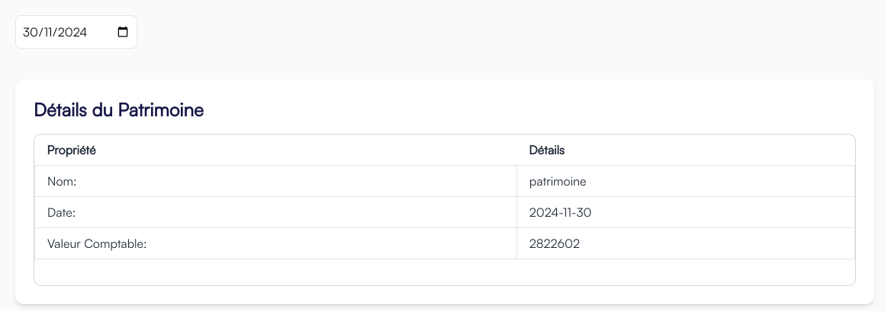
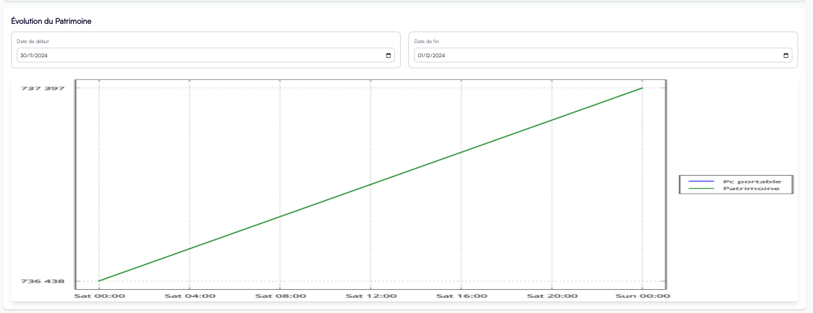

# Application de gestion de patrimoine

Cette application est conçue pour faciliter la gestion des possessions que ce soit des matériels,financieres,ou flux financiere.

## Les fonctionnalités:

* Projection  du futur valeur comptable du patrimoine.
    
    Selectionner une date pour voir que vaut le patrimoine à tel date.

* Apercevoir l'evolution du patrimoine entre une intervalle de date.

    L'application affiche un graphe correspondant chaque intervalle.

